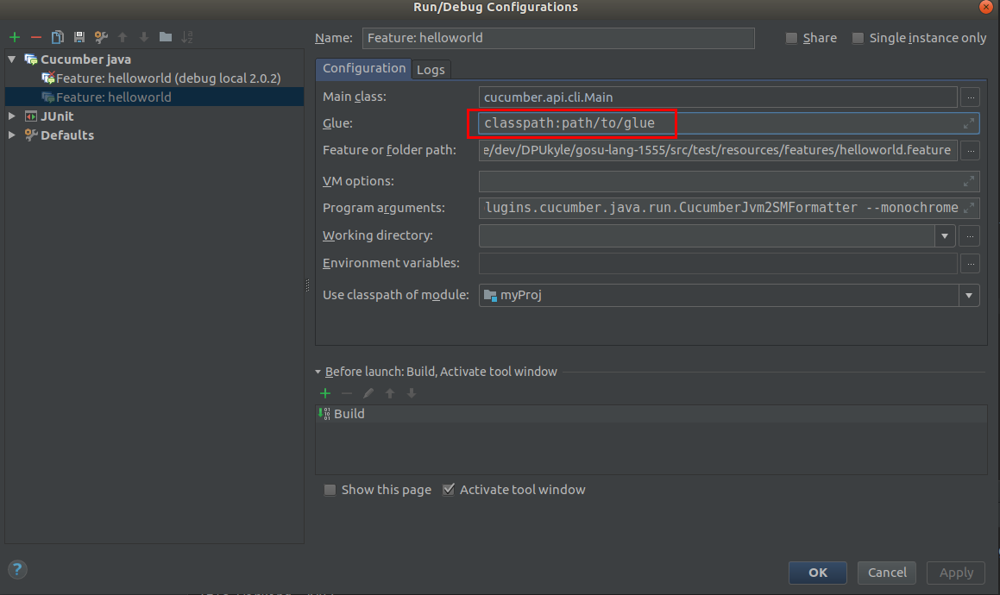
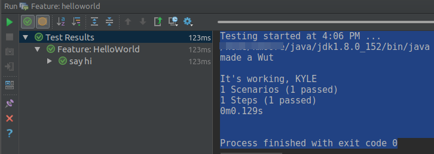

# cucumber-gosu test

This is a proof-of-concept for using Cucumber's native Gosu support using IntelliJ and/or Maven.

Background discussion here: https://groups.google.com/forum/#!topic/gosu-lang/q0KUQsu17xQ

Requires pending cucumber-gosu:2.0.2 with fixes from this PR: https://github.com/cucumber/cucumber-jvm-gosu/pull/3

## Run from maven

`mvn test`

Expected output:

    -------------------------------------------------------
     T E S T S
    -------------------------------------------------------
    Running path.to.tests.RunCukesTest
    made a Wut
    
    It's working, KYLE
    
    1 Scenarios (1 passed)
    1 Steps (1 passed)
    0m0.125s
    
    Tests run: 1, Failures: 0, Errors: 0, Skipped: 0, Time elapsed: 1.551 sec

## Run from IntelliJ Ultimate
Create Cucumber java feature run config as follows:

Don't forget to set the Glue path to `classpath:path/to/glue`

Then run the config! Expected output:

